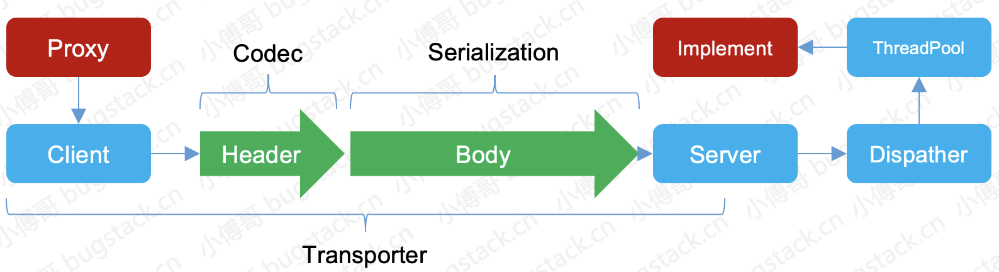
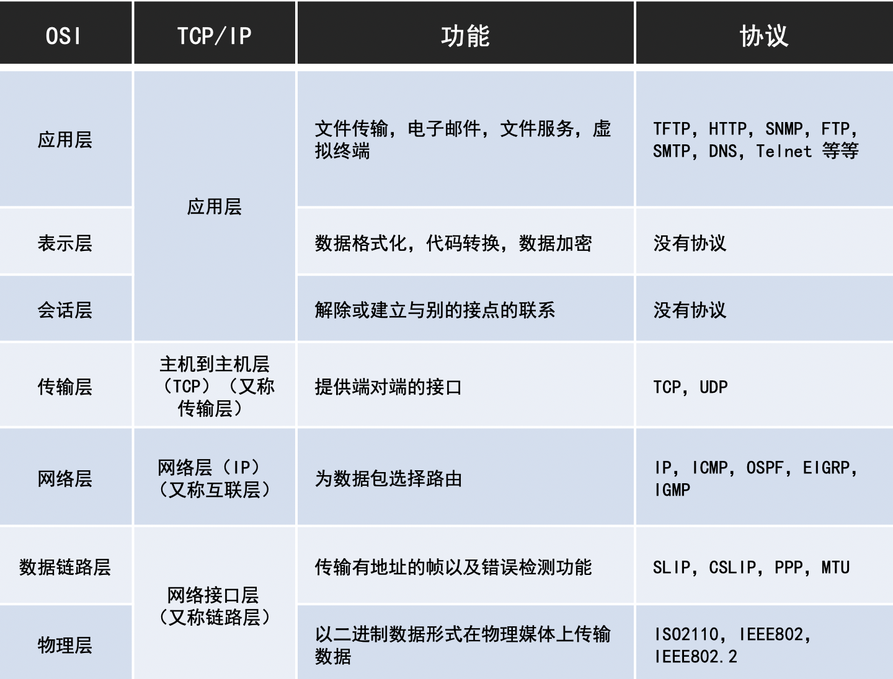

# 1 `手写一个线程安全的单例`

```java
public class Singleton {
    private static volatile Singleton instance;

    private Singleton() {

    }

    public static Singleton getInstance() {
        if (null != instance) {
            return instance;
        }
        synchronized (Singleton.class) {
            if (null == instance) {
                instance = new Singleton();
            }
        }
        return instance;
    }
}
```

# 2 `高并发下，单例模式会出现哪些问题`

- 单例模式就是防止线程不安全和提高代码执行效率而设计的。
- 双重锁定检查（DCL double check lock）就是为此而设计的。

# 3 `可见性和指令重排是怎么回事`

- 可见性： java编程语言允许线程访问共享变量，为了确保共享变量能被准确和一致的更新，线程应该确保通过排它锁单独获取这个变量。
- 指令重排：在执行过程中为了性能考虑，编译器和CPU可能会对指令重新排序。对于并发多线程的场景下，指令重排会产生不确定的执行效果。

# 4 `volatile 关键字为什么能解决可见性和指令重排`

## 可见性

- 首先，volatile 关键字修饰的共享变量可以提供这种可见性规范，也叫做读写可见。
- 被 volatile 关键字修饰的共享变量在转换成汇编语言时，会加上lock为前缀的指令，当CPU发现这个指令时，立即将当前高速缓存行的数据会写到内存，同时使在其他内核里缓存了该内存地址的数据无效。
- 另外，早期的CPU中，是通过在总线加LOCK# 锁的方式实现的，但这种方式开销较大。所以Intel开发了缓存一致性协议，也就是
  MESI协议，来解决缓存一致性。
- `volatile的好处`，volatile是一种非锁机制，这种方式机制可以避免锁机制引起的线程上下文切换和调度问题。所以，volatile
  的执行成本比synchronized 更低。
- `volatile的不足`， volatile关键字只能保证可见性，不能保证原子性。
- Unsafe.loadFence(); 保证在这个屏障之前的所有读操作都已经完成。

## 指令重排

```java
public volatile boolean sign;
        descriptor:Z
        flags:ACC_PUBLIC,ACC_VOLATILE
```

- 从字节码层面，添加ACC_VOLATILE，在汇编指令的打印会有 `lock addl $0x0,(%rsp)s`
- 从JVM层面， JMM 提供了8个 Happen-Before 规则来约束数据之间竞争、4个内存屏障（LL LS SL SS）和 As-if-serial
- 从硬件层面，sfence、lfence、mfence

# 5 `除了双重检查锁之外，还有什么别的办法实现线程安全的单例模式`

```java
public enum Singleton {
    INSTANCE;

    public void test() {
        System.out.println("hi~");
    }

    public void test() {
        Singleton.INSTANCE.test();
    }
}
```

- 枚举方式
- 这种方式解决了最主要的；线程安全、自由串行化、单一实例。

# 6 `看过什么原码？ JVM 的原码是否看过？`

- Dubbo、Spring、Mybatis等框架和一些中间件的原码，关于 JVM 多线程、并发、锁等核心内容的源码有所了解...

# 7 `Dubbo是怎么工作的？`

- 简单来说，引入Dubbo 服务的接口提供方与接口消费方，通过之策与拉取接口信息，把服务双方通过Socket进行连接。 之后接口通信的时候通过代理类传输
  Socket 请求，在由接口提供方通过反射调用真实服务，最终把接口执行信息返回给调用端。
- 涉及到：注册中心、代理、反射、通信模型以及Netty的相关知识，这主要包括了通信协议的定义、半包粘包以及流量整形和各类知识。

# 8 `Dubbo通信是用的什么协议？`



- Dubbo 主要支持这些协议： dubbo://、 rmi://、 hessian:// 、 http:// 、webservice://、thrift://
- rmi协议： 走java二进制序列化，多个短连接，适合消费者和提供这数量相当，适用于文件的传输，一般较少用
- dubbo协议：默认就是走此协议，单一长连接，NIO异步通信，基于hessian作为序列化协议
- hessian协议：走hessian序列化协议，多个短连接，适用于提供者数量比消费者还多，适用于文件的传输，一般较少用
- http协议：走json序列化
- 此外序列化的方式还有protobuf，protobuf全程Google Protocol Buffers，是Google开发的一套用于数据存储，网络通信时用于协议编解码的工具库。

# 9 `属于网络传输中的那一层？`

- TCP/IP 四层模型， 是 OSI 七层模型的简化，泛指众多（TCP，UDP，IP等）协议。
- Dubbo 协议是TCP协议之上的协议，采用单一长连接和NIO异步通讯。

#10 `TCP/IP协议来说，建立连接的时候，为什么需要三次握手？`
- 三次握手是在安全可靠的基础上最少握手次数的方案，而两次握手并不能保证可靠性，四次握手又浪费了传输效率。
- TCP传输控制协议，是一个面向连接的协议。在TCP/IP协议中， TCP协议提供可靠的连接服务，连接是通过三次握手进行初始化的。【可深入了解】

# 11 `什么场景下用得到kafka?`
| Syntax      | Description |
| ----------- | ----------- |
| Header      | Title       |
| Paragraph   | Text        |